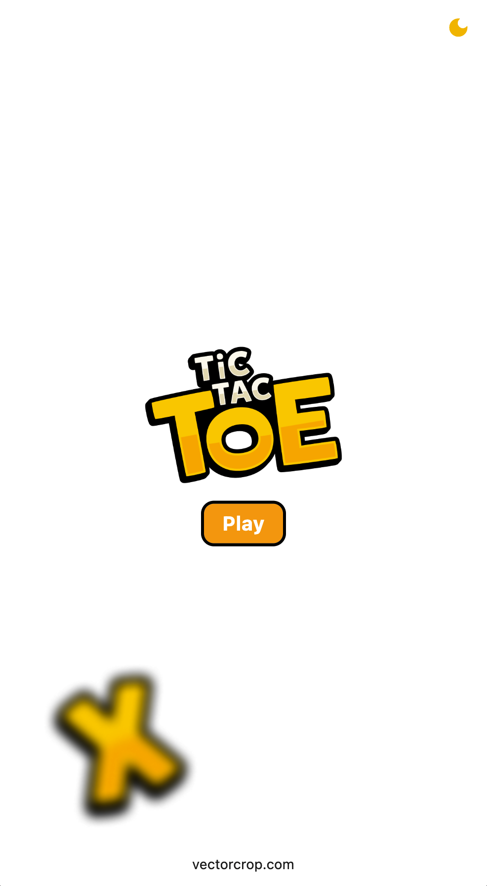
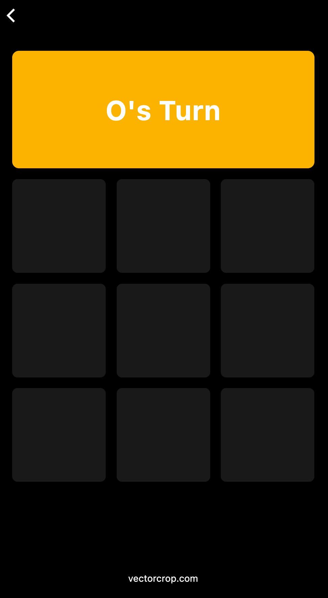

   

# Tic Tac Toe App

This is a Tic Tac Toe game application built using Flutter with light and dark themes, featuring faster state management using GetX library.

## Features

- Play Tic Tac Toe against another player.
- Switch between light and dark themes.
- Faster state management using GetX.
- Home page to start the game.
- Reset button to restart the game.

## Screenshots

 


## Installation

1. Clone the repository:

   ```
   git clone https://github.com/VectorCropCommunity/tic_tac_toe.git
   ```

2. Navigate into the project directory:

   ```
   cd tic_tac_toe_app
   ```

3. Install dependencies:

   ```
   flutter pub get
   ```

4. Run the app:

   ```
   flutter run
   ```

## Usage

- Launch the app to see the home page.
- Choose the theme (light/dark) from the settings.
- Click on the "Play" button to Start Game.
- Tap on the cells to make your moves.
- Use the reset button to restart the game at any time.

## Dependencies

- [Flutter](https://flutter.dev/)
- [GetX](https://pub.dev/packages/get)

## Contributing

Contributions are welcome! Feel free to submit pull requests or open an issue for bugs and feature requests.

## License

[MIT License](LICENSE)

## Download by paying 😂

https://play.google.com/store/apps/details?id=com.vectorcrop.guess_game
